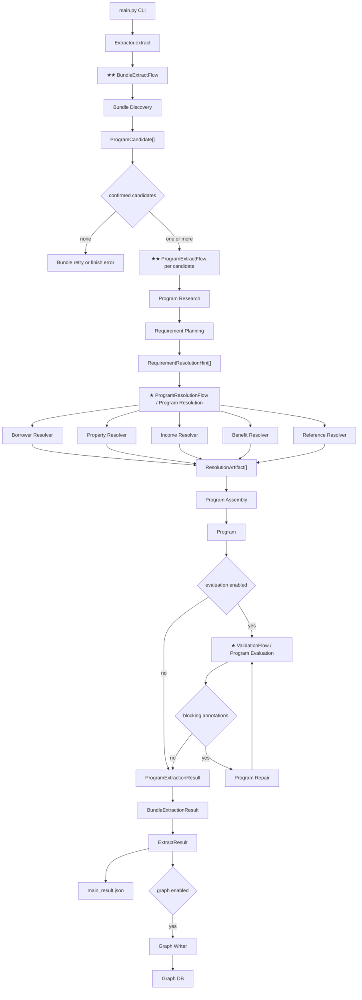
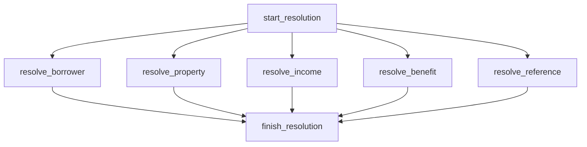
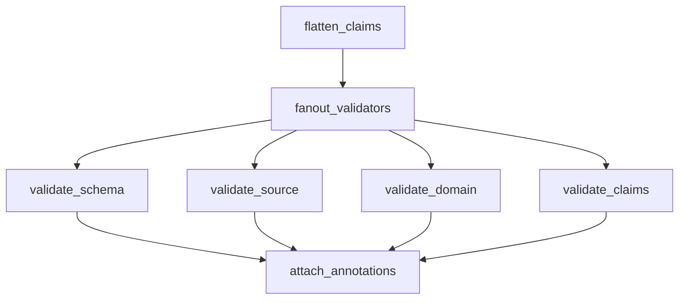
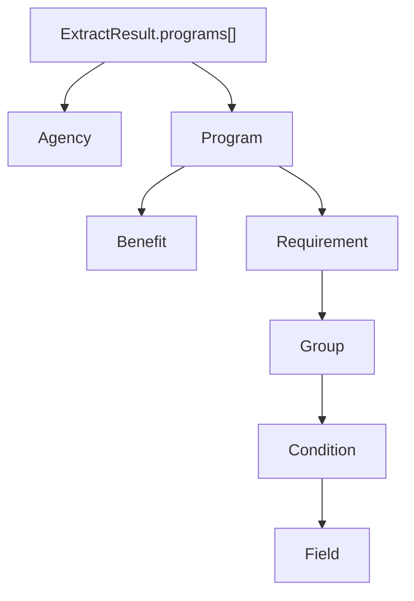

# DPA Extractor 架构与数据流说明

本文档用“流程节点 + 输入输出 DTO + 数据结构说明”的方式描述 `examples/dpa` 抽取器。重点不是解释代码目录，而是说明一次 DPA crawl bundle 从输入目录到结构化 `Program`、再到可选图写入的完整流转。

---

## 1. 总览：从 crawl bundle 到 graph-ready Program

### 1.1 外部输入与最终输出

| 类型 | 数据 | 说明 |
| --- | --- | --- |
| 输入 | `crawl_dir` | 单个 crawl bundle 目录，必须包含 `_manifest.json`，并包含已抓取的 `.md`、PDF、附件等源文件。 |
| 输入 | `_manifest.json` | crawl 元数据，至少需要 `pages`；通常包含 `entry_url`、`crawled_at`、页面/文件清单。 |
| 输入 | `Goal` | 控制研究轮次、重试次数、完成条件、停止条件。默认使用 `DPA_GOAL`。 |
| 输出 | `ExtractResult` | Facade 对外返回结果，包含 `directory`、`entry_url`、`is_relevant`、`programs`、`error`。 |
| 输出 | `main_result.json` | CLI 汇总文件，记录每个 bundle 的抽取结果、统计、token usage、cost estimate。 |
| 可选输出 | Graph DB | 当未传 `--no-graph` 时，CLI 将 `Program -> Requirement -> Group -> Condition -> Field` 写入图数据库。 |
| 运行痕迹 | `_extractor_cache` | 当前流程不读旧 cache；每次运行会写 candidates、program trace、usage/cost 等留痕文件。 |

### 1.2 Flow 星号索引

星号用于快速识别编排层级：`★★` 表示主 Flow，`★` 表示子 Flow。

| 星级 | Flow | 层级 | 触发位置 | 说明 |
| --- | --- | --- | --- | --- |
| ★★ | `BundleExtractFlow` | 主 Flow | `Extractor.extract()` | 一个 crawl bundle 的总编排：manifest、candidate discovery、program 并发处理、结果聚合。 |
| ★★ | `ProgramExtractFlow` | 主 Flow | `BundleExtractFlow.process_programs` | 一个 confirmed candidate 的隔离抽取编排：research、planning、resolution、assembly、evaluation、repair。 |
| ★ | `ProgramResolutionFlow` | 子 Flow | `ProgramExtractFlow.resolve_requirements` | resolver 并发子图：borrower/property/income/benefit/reference。 |
| ★ | `ValidationFlow` | 子 Flow | `ProgramExtractFlow.evaluate_program` | validation 并发子图：schema/source/domain/claim validators。 |

### 1.3 高层流程图



### 1.4 核心数据链路

```text
crawl_dir + _manifest.json + Goal
  -> BundleResearchInput
  -> ResearchRound[]
  -> ProgramCandidate[]
  -> confirmed ProgramCandidate
  -> ProgramResearchInput
  -> ResearchRound[]
  -> RequirementPlanningInput
  -> RequirementResolutionHint[]
  -> ProgramResolutionInput
  -> ResolutionArtifact[]
  -> ProgramAssemblyInput
  -> ResearchExtraction + Program
  -> ProgramEvaluationInput
  -> EvaluationAnnotation[] attached to Program/Requirement/Condition
  -> optional ProgramRepairInput
  -> ProgramExtractionResult
  -> BundleExtractionResult
  -> ExtractResult
  -> optional graph write
```

---

## 2. 流程节点清单

### 2.1 CLI 与 facade 层

| 节点 | 位置 | 输入 | 输出 | 说明 |
| --- | --- | --- | --- | --- |
| `main()` | `examples/dpa/main.py` | CLI 参数：`crawl_dir`、`--no-graph`、`--no-evaluation`、`--clear-cache`、`--model`、`--timeout` 等 | `main_result.json`，可选 Graph DB 写入 | 负责参数解析、单目录/批量目录识别、图连接、批量循环、统计汇总。 |
| `process_one()` | `examples/dpa/main.py` | 单个 `crawl_dir`、Graph 实例或 `None`、模型配置、运行配置 | stats、usage、cost、`ExtractResult` | 调用 `Extractor.extract()`；成功后按 `--no-graph` 决定是否写图。 |
| `Extractor.extract()` | `examples/dpa/extractor/facade.py` | `directory: str` | `ExtractResult` | Facade 层，屏蔽内部 `BundleExtractFlow`；收集 `conversation_dumps` 和 `program_results`；将验证失败转换成 `ExtractResult.error`。 |

### 2.2 ★★ BundleExtractFlow 节点

`BundleExtractFlow` 处理一个 crawl bundle。它的职责是：加载 manifest、发现候选项目、为每个 confirmed candidate 启动隔离的 `ProgramExtractFlow`、最后聚合结果。

| 节点 | 输入 | 输出 | 状态读写 | 说明 |
| --- | --- | --- | --- | --- |
| `start` | `directory: str` | 绝对路径 `directory` | 写 `directory`、`manifest`、`entry_url`、`error` | 初始化 bundle state，创建 `ExtractCache`，可按 `clear_cache` 清理旧痕迹，加载 `_manifest.json`。 |
| `discover_programs` | `directory` | `list[ProgramCandidate]` | 写 `program_candidates`、`rounds`、`conversation_dumps` | 调用 `BundleResearchStep`，做 bundle 级候选项目发现；将 candidates 写入 `_extractor_cache/candidates.json`。 |
| `gate_program_candidates` | `list[ProgramCandidate]` | goto `process_programs` 或 retry/finish | 读写 `retry_count`、`error` | 只允许 `status == "confirmed"` 的 candidate 进入 program flow；如果没有 confirmed candidate，会在重试预算内重新 discovery。 |
| `process_programs` | `list[ProgramCandidate]` | `list[ProgramExtractionResult]` | 写 program trace cache | 对 confirmed candidates 并发运行 `ProgramExtractFlow`，默认并发上限 `max_program_concurrency=2`。每个 candidate 独立处理，避免 program 间状态污染。 |
| `aggregate_results` | `list[ProgramExtractionResult]` | `BundleExtractionResult` | 写 `program_results`、`programs`、`resolution_hints`、`resolution_artifacts`、`extraction` | 合并各 program flow 的产物，去重 program，并生成 bundle 级 `ResearchExtraction` 汇总。 |
| `finish` | `BundleExtractionResult` | `BundleExtractionResult` | 读最终 state | 返回 bundle 级结果。 |

### 2.3 ★★ ProgramExtractFlow 节点

`ProgramExtractFlow` 处理一个 `ProgramCandidate`。它是“单 program 隔离流程”，负责把候选项目变成一个结构化、可验证的 `Program`。

| 节点 | 输入 | 输出 | 下一跳 | 说明 |
| --- | --- | --- | --- | --- |
| `start_program` | `None` | `None` | `research_program` | 标记 program flow 开始，记录日志。 |
| `research_program` | `None` | `list[ResearchRound]` | `plan_requirements` 或 retry/finish | 调用 `ProgramResearchStep` 深入读取候选项目源文件，产出 program-scoped evidence 和 `resolution_hints`。如果没有 round，会按 retry 预算重试。 |
| `plan_requirements` | `list[ResearchRound]` | `list[RequirementResolutionHint]` | `resolve_requirements` 或 retry/finish | 从 research rounds 归并、归一化、去重 hints；如果 research 没给 hint，则调用 `RequirementHintGenerationStep` 从 evidence 补生成。 |
| `resolve_requirements` | `None` | `ProgramResolutionResult` | `assemble_program` | 调用 `ProgramResolutionStep`，按 `resolution_type` 并发调度业务 resolver，输出各类 `ResolutionArtifact`。 |
| `assemble_program` | `None` | `ResearchExtraction` | `evaluate_program` | 调用 `ProgramAssemblyStep`，把 candidate、rounds、hints、artifacts 组装成 `Program`；若 LLM 未返回 scoped program，则构造 deterministic fallback shell。 |
| `evaluate_program` | `ResearchExtraction` | `ProgramEvaluationResult` | `repair_program` 或 `finish_program` | 如果启用 evaluation，运行四类 validator，把问题以 `EvaluationAnnotation` 形式挂回实体；如果禁用 evaluation，则直接结束。 |
| `repair_program` | `None` | `Program | None` | `evaluate_program` 或 `finish_program` | 若当前 evaluation run 存在 blocking annotation，调用 `ProgramRepairStep` 修复 `Program`，再回到 evaluation。重试耗尽则失败结束。 |
| `finish_program` | `ProgramExtractionResult` | `ProgramExtractionResult` | end | 返回单 program 的完整产物：candidate、rounds、hints、artifacts、program、trace、error。 |

### 2.4 ★ ProgramResolutionFlow 并发 resolver 子 Flow 节点

`ProgramResolutionStep` 内部再启动一个 `ProgramResolutionFlow`。该 flow 只负责 resolver 并发调度，不做 assembly。



| Resolver 节点 | 处理的 `resolution_type` | Resolver | 中间 extraction | 产物形态 |
| --- | --- | --- | --- | --- |
| `resolve_borrower` | `borrower_eligibility` | `BorrowerEligibilityResolver` | `BorrowerEligibilityExtraction` | `paths[] -> Group[] -> Condition[]` |
| `resolve_property` | `property_eligibility` | `PropertyEligibilityResolver` | `PropertyEligibilityExtraction` | `paths[] -> Group[] -> Condition[]` |
| `resolve_income` | `income_limit` | `IncomeLimitResolver` | `IncomeLimitRowExtraction` | `rows[] -> Group[] -> Condition[]` |
| `resolve_benefit` | `assistance_benefit` | `AssistanceBenefitResolver` | `AssistanceBenefitExtraction` | `variants[] -> Group[] -> Condition[]` |
| `resolve_reference` | `reference` | `ReferenceResolver` | 无 LLM extraction | `reference_only ResolutionArtifact` |

### 2.5 ★ ValidationFlow 子 Flow 节点

`ProgramEvaluationStep` 内部运行 `ValidationFlow`，它把 `Program.requirements[].groups[].conditions[]` 展平成 `GraphClaim[]`，再并发执行 validators。



| 节点 | 输入 | 输出 | 说明 |
| --- | --- | --- | --- |
| `flatten_claims` | `Program[]` | `GraphClaim[]` | 将每个 searchable `Condition` 转成一个原子 claim，并建立 `claim_path -> entity` 映射。 |
| `validate_schema` | `GraphClaim[]` | `ValidationFinding[]` | 检查 `field_path` 是否在受控词表、operator 是否合法、typed value 是否存在、source 是否存在。 |
| `validate_source` | `GraphClaim[]` | `ValidationFinding[]` | 检查 claim 引用的 source 文件是否能在 crawl directory 中找到。 |
| `validate_domain` | `GraphClaim[]` | `ValidationFinding[]` | 执行业务域规则检查。 |
| `validate_claims` | `GraphClaim[]` | `ValidationFinding[]` | 执行 claim 一致性检查。 |
| `attach_annotations` | 所有 findings | `ValidationState` | 将 findings 转成 `EvaluationAnnotation`，挂回对应 `Condition` 或 fallback 到 `Program`。 |

---

## 3. 节点输入输出 DTO 说明

### 3.1 Bundle 层 DTO

#### `BundleResearchInput`

| 字段 | 类型 | 说明 |
| --- | --- | --- |
| `directory` | `str` | crawl bundle 绝对路径。 |
| `manifest` | `dict[str, Any]` | `_manifest.json` 内容。 |
| `goal` | `Goal` | 控制 research loop、retry、done/stop 条件。 |

#### `BundleExtractionResult`

| 字段 | 类型 | 说明 |
| --- | --- | --- |
| `directory` | `str` | 输入目录。 |
| `entry_url` | `str` | manifest 中的入口 URL。 |
| `program_candidates` | `list[ProgramCandidate]` | bundle discovery 发现的候选项目，包含 confirmed/rejected/merged/uncertain。 |
| `program_results` | `list[ProgramExtractionResult]` | 每个 confirmed candidate 的隔离 program flow 结果。 |
| `resolution_hints` | `list[RequirementResolutionHint]` | 聚合后的所有 program-scoped hints。 |
| `resolution_artifacts` | `list[ResolutionArtifact]` | 聚合后的所有 resolver artifacts。 |
| `extraction` | `ResearchExtraction | None` | bundle 级诊断汇总。 |
| `programs` | `list[Program]` | 去重后的最终 programs。 |
| `conversation_dumps` | `list[dict[str, Any]]` | 所有 LLM 对话 trace。 |
| `error` | `str | None` | bundle 失败原因。 |

### 3.2 Program research / planning DTO

#### `ProgramResearchInput`

| 字段 | 类型 | 说明 |
| --- | --- | --- |
| `directory` | `str` | crawl bundle 目录。 |
| `manifest` | `dict[str, Any]` | manifest 内容。 |
| `goal` | `Goal` | research 最大轮次和 retry 规则。 |
| `program_key` | `str` | 当前 program 的稳定 key。 |
| `candidate` | `ProgramCandidate` | 当前隔离处理的候选项目。 |

#### `RequirementPlanningInput`

| 字段 | 类型 | 说明 |
| --- | --- | --- |
| `rounds` | `list[ResearchRound]` | program research 的所有回合。 |
| `manifest` | `dict[str, Any]` | 用于补齐 source URL。 |
| `program_key` | `str` | 只保留该 program 的 hints。 |

#### `RequirementHintGenerationInput`

| 字段 | 类型 | 说明 |
| --- | --- | --- |
| `rounds` | `list[ResearchRound]` | research 回合。 |
| `manifest` | `dict[str, Any]` | source 标准化上下文。 |
| `program_key` | `str` | 当前 program key。 |
| `candidate` | `ProgramCandidate` | 用于从 candidate evidence 补 hint。 |

### 3.3 Resolution DTO

#### `ProgramResolutionInput`

| 字段 | 类型 | 说明 |
| --- | --- | --- |
| `directory` | `str` | resolver 工具读取文件的 workdir。 |
| `manifest` | `dict[str, Any]` | source URL/file 标准化上下文。 |
| `program_key` | `str` | 当前 program key；resolver output 必须 scoped 到它。 |
| `resolution_hints` | `list[RequirementResolutionHint]` | 等待路由到业务 resolver 的需求提示。 |

#### `ResolverContext`

| 字段 | 类型 | 说明 |
| --- | --- | --- |
| `directory` | `str` | 文件/PDF 工具工作目录。 |
| `manifest` | `dict[str, Any]` | source 补全和校验上下文。 |
| `program_key` | `str` | 当前 resolver 所属 program。 |

#### `ProgramResolutionResult`

| 字段 | 类型 | 说明 |
| --- | --- | --- |
| `borrower_artifacts` | `list[ResolutionArtifact]` | 借款人资格 resolver 产物。 |
| `property_artifacts` | `list[ResolutionArtifact]` | 房产资格 resolver 产物。 |
| `income_artifacts` | `list[ResolutionArtifact]` | 收入限制 resolver 产物。 |
| `benefit_artifacts` | `list[ResolutionArtifact]` | 援助福利 resolver 产物。 |
| `reference_artifacts` | `list[ResolutionArtifact]` | reference fallback 产物。 |
| `conversation_dumps` | `list[dict[str, Any]]` | resolver 对话 trace。 |
| `resolution_artifacts` | property | 上述五类 artifacts 的合并视图。 |

### 3.4 Assembly / evaluation / repair DTO

#### `ProgramAssemblyInput`

| 字段 | 类型 | 说明 |
| --- | --- | --- |
| `directory` | `str` | crawl bundle 目录。 |
| `entry_url` | `str` | manifest 入口 URL。 |
| `manifest` | `dict[str, Any]` | manifest 内容。 |
| `program_key` | `str` | 当前 program key。 |
| `candidate` | `ProgramCandidate` | discovery 阶段确定的候选边界。 |
| `rounds` | `list[ResearchRound]` | program research 证据和诊断。 |
| `resolution_hints` | `list[RequirementResolutionHint]` | resolver 输入，用于追溯。 |
| `resolution_artifacts` | `list[ResolutionArtifact]` | resolver 输出，用于落到 `Program.requirements`。 |

#### `ProgramEvaluationInput`

| 字段 | 类型 | 说明 |
| --- | --- | --- |
| `extraction` | `ResearchExtraction | None` | assembly 阶段诊断和 program 输出。 |
| `program` | `Program | None` | 待验证 program。 |
| `candidate` | `ProgramCandidate` | 当前候选项目。 |
| `directory` | `str` | source validator 检查文件时使用。 |
| `resolution_artifacts` | `list[ResolutionArtifact]` | 用于额外 gate，例如 income resolver 不能 reference-only。 |
| `run_id` | `str` | 当前 evaluation pass 标识。 |

#### `ProgramEvaluationResult`

| 字段 | 类型 | 说明 |
| --- | --- | --- |
| `program` | `Program | None` | 被 annotation 标注后的 program。 |
| `candidate` | `ProgramCandidate` | 被 annotation 标注后的 candidate。 |

#### `ProgramRepairInput`

| 字段 | 类型 | 说明 |
| --- | --- | --- |
| `program` | `Program` | 当前失败或有 blocking annotations 的 program。 |
| `annotations` | `list[EvaluationAnnotation]` | 本轮需要修复的问题。 |
| `directory` | `str` | 修复时可重新读源文件。 |
| `manifest` | `dict[str, Any]` | source 上下文。 |
| `program_key` | `str` | 修复后仍必须保持的 program key。 |
| `repair_count` | `int` | 当前修复次数。 |
| `current_evaluation_run_id` | `str` | 触发修复的 evaluation run。 |

---

## 4. 核心业务数据结构说明

### 4.1 `ProgramCandidate`

`ProgramCandidate` 是 bundle discovery 输出的候选项目边界。它不是最终 program，只回答“这个 crawl bundle 里有哪些可能的 DPA 项目”。

| 字段 | 说明 |
| --- | --- |
| `program_key` | 稳定 snake_case key；后续 `ProgramExtractFlow` 以它作为隔离边界。 |
| `name_hint` | 候选项目名称或页面标题提示。 |
| `status` | `confirmed`、`rejected`、`merged`、`uncertain`。只有 `confirmed` 会进入 program flow。 |
| `reason` | 为什么这样分类。 |
| `sources` | 定义候选边界的源文件/URL。 |
| `evidence` | 支持或反驳该候选的证据。 |
| `merged_into` | 当 status 为 merged 时，指向目标 candidate key。 |

### 4.2 `ResearchRound`

`ResearchRound` 是 LLM research step 每一轮的结构化返回。它的关键职责是：收集 evidence，并显式产出 resolver 可消费的 `resolution_hints`。

| 字段 | 说明 |
| --- | --- |
| `analysis` | 本轮研究发现摘要。 |
| `files_read` | 本轮读过/搜索过/检查过的文件。 |
| `confirmed_candidates` | 本轮确认的候选项目说明。 |
| `rejected_candidates` | 本轮排除的候选项目说明。 |
| `evidence` | source-grounded 证据。 |
| `resolution_hints` | 关键字段：后续 resolver 的输入。不能只把需求写在 analysis 里。 |
| `remaining_questions` | 仍不确定的问题。 |
| `next_focus` | 下一轮 research 的重点。 |
| `ready_to_extract` | research 是否已足够进入下一阶段。 |

### 4.3 `RequirementResolutionHint`

`RequirementResolutionHint` 是 research/planning 到 resolver 的路由契约。它不直接承载最终条件，而是告诉系统“哪个 requirement 应该由哪个 resolver 用哪些 source 解析”。

| 字段 | 说明 |
| --- | --- |
| `program_key` | hint 所属 program。必须与当前 flow 的 `program_key` 一致。 |
| `requirement_key` | 稳定 requirement key。为空时 planning 会从 title slug 生成。 |
| `requirement_title` | 面向人类的 requirement 标题。 |
| `resolution_type` | resolver 路由类型：`borrower_eligibility`、`property_eligibility`、`income_limit`、`assistance_benefit`、`reference`。 |
| `sources` | resolver 必须使用的 source refs。 |
| `fallback_policy` | resolver 无法完整结构化时的兜底策略，默认 `reference_with_warning`。 |
| `evidence_summary` | 面向 resolver 的规则摘要。 |

### 4.4 `ResolutionArtifact`

`ResolutionArtifact` 是 resolver 的标准输出，也是 assembly 将结构化条件落到 `Program.requirements` 的主要输入。

| 字段 | 说明 |
| --- | --- |
| `program_key` | artifact 所属 program。assembly 会按该 key 过滤。 |
| `requirement_key` | 对应 requirement key。 |
| `requirement_title` | 对应 requirement 标题。 |
| `resolver` | 产出该 artifact 的 resolver 名称。 |
| `resolver_version` | resolver 版本。 |
| `status` | `fully_structured`、`partially_structured`、`reference_only`、`failed`。 |
| `confidence` | `high`、`medium`、`low`。 |
| `warnings` | resolver 产生的警告。 |
| `sources` | 支撑该 requirement 的来源。 |
| `groups` | 最关键输出：`Group[]`，最终会成为 `Requirement.groups`。 |
| `metadata` | resolver-specific metadata，通常包含 `resolution_type`。 |

### 4.5 `Program`

`Program` 是最终 graph-ready 的业务对象。它既保留人类可读摘要字段，也承载 eligibility/query engine 需要的结构化 requirements。

| 字段 | 说明 |
| --- | --- |
| `canonical_program_id` | 稳定 program id，通常等于 `program_key`。 |
| `program_name` | 项目名称。 |
| `agency` | 管理机构。 |
| `assistance_type` | 援助类型，如 grant、deferred loan、forgivable loan、second mortgage。 |
| `benefits` | 结构化 financial assistance benefit 列表。 |
| `eligibility` | 人类可读 eligibility 摘要。 |
| `income_limits` | 人类可读 income limit 摘要。结构化限制应落在 `requirements.groups.conditions`。 |
| `purchase_price_limits` | 人类可读 purchase price limit 摘要。结构化限制应落在 conditions。 |
| `property_requirements` | 人类可读 property requirement 摘要。 |
| `sources` | program 级 source refs。 |
| `metadata` | `ProgramMetadata`，记录 crawl_dir、entry_url、program_key、workflow 等。 |
| `requirements` | eligibility/query 的核心结构化规则集合。 |

### 4.6 `Requirement -> Group -> Condition`

这是 Graph 作为 eligibility/query engine 的核心结构。

```text
Program
  -> Requirement[]
      -> Group[]
          -> Condition[]
```

| 层级 | 语义 | 说明 |
| --- | --- | --- |
| `Requirement` | 一个业务需求 | 如 first-time homebuyer、income limit、eligible county、max assistance。 |
| `Group` | 一组可选路径或表格行 | 同一 requirement 下可以有多个 group；每个 group 内通常是 AND。比如 income limit 表的每一行是一个 group。 |
| `Condition` | 一个原子可查询断言 | 如 `borrower.annual_income <= 120000`、`property.county == "Orange"`。 |

#### `Requirement` 关键字段

| 字段 | 说明 |
| --- | --- |
| `key` | requirement 稳定 key。 |
| `title` | requirement 标题。 |
| `category` | `borrower`、`income`、`property`、`loan`、`education`、`workflow` 等。 |
| `groups` | 条件组。没有 groups 或 conditions 的 requirement 会被 evaluation 标成问题。 |
| `resolution_status` | 从 artifact 继承的结构化状态。 |
| `resolution_type` | resolver 路由类型。 |
| `resolver` / `resolver_version` | 产出该 requirement 条件的 resolver。 |
| `confidence` / `warnings` | resolver 置信度和警告。 |

#### `Group` 关键字段

| 字段 | 说明 |
| --- | --- |
| `key` | group 稳定 key。 |
| `logic` | 组内逻辑，目前主要是 `AND`。 |
| `kind` | 业务组类型，例如 `income_limit_row`、`borrower_eligibility_standard`。 |
| `conditions` | 该组内的原子 conditions。 |
| `sources` | 支撑该组的 sources。 |

#### `Condition` 关键字段

| 字段 | 说明 |
| --- | --- |
| `field_path` | 受控字段路径，必须来自 `FIELD_VOCABULARY`。 |
| `operator` | 比较符：`==`、`<=`、`>=`、`in`、`exists`、`between`。 |
| `value_type` | `number`、`string`、`boolean`、`range`、`list`、`reference`、`unknown`。 |
| `numeric_value` / `string_value` / `boolean_value` | 类型化值，用于查询和验证。 |
| `unit` | 单位，如 `usd`、`percent`、`months`、`years`、`count`。 |
| `reference_basis` | 参考基准，如 `AMI`、`county_limit`、`program_income_limit`。 |
| `expression` | 人类可读表达式。 |
| `sources` | condition 的 source refs；缺失会被 schema validator 报错。 |
| `resolver` / `resolver_version` | 该 condition 的来源 resolver。 |

### 4.7 `GraphClaim` 与 `ValidationFinding`

`GraphClaim` 是 validation 阶段从 `Condition` 展平得到的原子校验对象。validator 不直接遍历复杂 graph，而是检查 claims。

| 数据结构 | 说明 |
| --- | --- |
| `GraphClaim` | 包含 `program_key`、`requirement_key`、`group_key`、`condition_index`、`field_path`、`operator`、typed value、sources、resolver。 |
| `ValidationFinding` | validator 输出的问题，包含 `severity`、`category`、`message`、`claim_path`。 |
| `EvaluationAnnotation` | finding 挂回实体后的 annotation。blocking severity 通常是 `error` 或 `fatal`。 |

---

## 5. Resolver 业务边界

| `resolution_type` | Resolver | 负责结构化的规则 | 不应承担的职责 |
| --- | --- | --- | --- |
| `borrower_eligibility` | `BorrowerEligibilityResolver` | first-time homebuyer、education、FICO、residency、borrower contribution 等借款人资格。 | 不解析收入表矩阵，不解析房产地理/价格限制。 |
| `property_eligibility` | `PropertyEligibilityResolver` | county/city、occupancy、property type、unit count、purchase price 等房产资格。 | 不解析 borrower income table，不解析 assistance repayment。 |
| `income_limit` | `IncomeLimitResolver` | household size、county、AMI、income limit rows/matrices/formulas。 | 不把 income table 留成 prose/reference-only，除非确实无法结构化。 |
| `assistance_benefit` | `AssistanceBenefitResolver` | max amount、percentage、formula、repayment、forgiveness、loan terms。 | 不解析 borrower/property eligibility。 |
| `reference` | `ReferenceResolver` | 未匹配专用 resolver 的事实兜底。 | 不应成为结构化规则的常态输出。 |

Resolver 的标准流程是：

```text
RequirementResolutionHint + ResolverContext
  -> resolver-specific LLM extraction
  -> normalize into ResolutionArtifact
  -> validate basic artifact shape
  -> ResolutionArtifact.groups[]
```

---

## 6. Assembly 如何使用 resolver artifacts

`ProgramAssemblyStep` 做两件事：

1. **LLM 组装 program shell**：根据 candidate、research rounds、artifacts 生成 `ResearchExtraction.programs[]`。
2. **确定性合并 artifacts**：调用 `apply_artifacts()`，把 `ResolutionArtifact.groups` 写入对应 `Requirement.groups`。

合并规则：

| 场景 | 行为 |
| --- | --- |
| artifact 的 `program_key` 不匹配当前 program | 跳过，防止跨 program 污染。 |
| 找到同 key 的 requirement | 用 artifact 的 groups/status/resolver/confidence/warnings 覆盖或补齐该 requirement。 |
| 没找到 requirement 但 artifact 有 groups | 创建新的 `Requirement` 并追加到 `Program.requirements`。 |
| LLM 没返回 program | 构造 fallback program shell，并根据 hints 创建 fallback requirements。 |
| artifact 没 groups | 不会凭空创建可查询条件；后续 evaluation 可能标出 requirement 空壳问题。 |

---

## 7. Evaluation 与 repair 触发逻辑

### 7.1 Evaluation 做什么

`ProgramEvaluationStep` 有两层检查：

| 检查 | 说明 |
| --- | --- |
| Assembly gates | 如果 requirement 没有 groups/conditions，会添加 `assembly` error；如果 `IncomeLimitResolver` 输出 `failed` 或 `reference_only`，会添加 error。 |
| ValidationFlow | 将 conditions 展平成 `GraphClaim[]`，并发执行 schema/source/domain/claim validators。 |

### 7.2 Repair 什么时候运行

`repair_program` 会读取当前 evaluation run 的 blocking annotations：

```text
severity in {"error", "fatal"}
```

如果存在 blocking annotations 且 `repair_count < Goal.max_retries`：

```text
ProgramRepairInput
  -> ProgramRepairStep
  -> repaired Program
  -> ProgramAssemblyStep.apply_artifacts
  -> evaluate_program again
```

如果没有 blocking annotations，则 program flow 正常结束。

---

## 8. 缓存、痕迹与运行摘要

### 8.1 `_extractor_cache`

当前主流程的语义是：**不读旧 cache，始终写运行痕迹**。

| 文件 | 说明 |
| --- | --- |
| `_extractor_cache/candidates.json` | bundle discovery 输出的候选项目列表。 |
| `_extractor_cache/programs/{program_key}.json` | 每个 program flow 的结果、trace summary、usage summary。即使 invalid，也会以 failed trace 形式保存。 |
| program cost estimate patch | CLI 估算 token/cost 后，会把 per-program cost 写回对应 program cache JSON。 |

### 8.2 `conversation_dumps`

每次 LLM 相关步骤都会通过 `Trace.conversation()` 留下结构化 trace：

| kind | 来源 |
| --- | --- |
| `bundle_discovery` | `BundleResearchStep` |
| `program_research` | `ProgramResearchStep` |
| `requirement_hint_generation` | `RequirementHintGenerationStep` |
| `resolver_{resolution_type}` | 各业务 resolver |
| `program_assembly` | `ProgramAssemblyStep` |
| `program_repair` | `ProgramRepairStep` |

### 8.3 `main_result.json`

`main_result.json` 是 CLI 运行摘要，不是 extractor 内部 DTO。

| 字段 | 说明 |
| --- | --- |
| `input_path` | CLI 输入路径。 |
| `model` / `llm_timeout` / `run_id` | 本次运行配置。 |
| `graph_uri` | graph enabled 时的 URI；`--no-graph` 时为 `null`。 |
| `cache_read_enabled` | 当前为 `false`。 |
| `trace_write_enabled` | 当前为 `true`。 |
| `evaluation_enabled` | 是否启用 validation/repair。 |
| `totals` | 批量运行累计统计。 |
| `usage_summary` | token usage 汇总。 |
| `usage_cost_estimate` / `usage_cost_report` | cost 估算结果。 |
| `bundles[]` | 每个 crawl bundle 的 result、stats、usage、cost。 |

---

## 9. 图写入模型

Graph 写入是 `main.py` 的可选后处理。Extractor 本身到 `ExtractResult` 为止；是否写图由 CLI `--no-graph` 控制。



写图时的核心原则：

- **Program 是业务主体**：对应一个 source-grounded DPA program。
- **Requirement/Group/Condition 是查询主体**：eligibility 判断应尽量沉淀为可查询 conditions，而不是只存在 prose 字段里。
- **Field 是受控词表节点**：`Condition.field_path` 应来自 `FIELD_VOCABULARY`，保证 query translator 和 validator 可用。
- **Source/provenance 必须保留**：Program、Requirement、Group、Condition 都应尽量带 source refs。缺失 source 会被 validation 标记。 

---

## 10. 架构边界与约束

| 原则 | 说明 |
| --- | --- |
| Flow state 只属于 flow | `BundleExtractState`、`ProgramExtractState` 是内部编排状态，不作为跨层 API。 |
| Step/resolver 接显式 DTO | 外部组件只接收 `context.py` 中定义的输入对象，避免直接依赖 flow state。 |
| Research 只发现和路由 | Research 必须输出 `RequirementResolutionHint`，但不负责展开大表或最终 conditions。 |
| Resolver 负责业务结构化 | 表格、矩阵、金额、百分比、枚举、日期窗口等结构化规则应由专用 resolver 处理。 |
| Assembly 不应吞掉 artifacts | `ResolutionArtifact.groups` 必须落到 `Program.requirements[].groups`，否则图无法做 eligibility/query。 |
| Evaluation 是质量门 | schema/source/domain/claim validators 决定 program 是否可被视为有效。 |
| Repair 是有限循环 | 只根据 blocking annotations 修复，受 `Goal.max_retries` 限制。 |
| Graph 是 eligibility/query engine | 复杂资格规则最终应沉淀为可查询结构，不应只留在 reference/prose 中。 |
